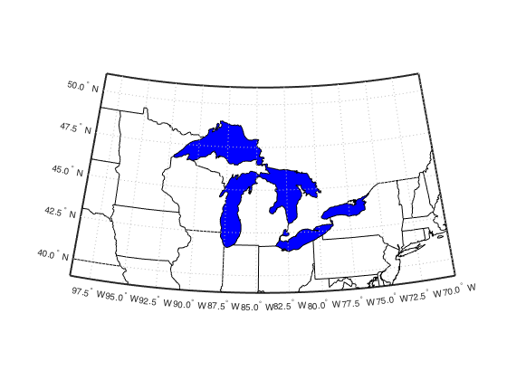
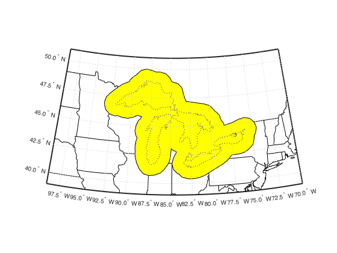

## bufferm2.m Documentation

This function is mostly a legacy one.  In early versions of the Mapping Toolbox (circa 2005 or so), the bufferm.m function included some buggy behavior, causing it to be very slow and occasionally fail completely.  I wrote this function as a replacement.  

The bugs were corrected in R2006b, but I kept this version around because it handled polygon holes more robustly than the original: bufferm simply filled them in, while bufferm2 trims or pads holes according to the buffer width.

Somewhere between R2006b and R2013a, the behavior of bufferm.m was updated to handle holes in the same way as my version.  So now, really the only difference between the two is that mine can be applied in cartesian coordinates.

### Syntax

```
[latb,lonb] = bufferm2(lat,lon,dist,direction)
[latb,lonb] = bufferm2(lat,lon,dist,direction,npts)
[latb,lonb] = bufferm2(lat,lon,dist,direction,npts,outputformat)
[xb,  yb]   = bufferm2('xy',x,y,dist,direction,npts,outputformat)
```
See function help for description of input and output variables.

### Example


We'll use the Great Lakes polygons as our starting point.

```matlab
load conus;

usamap({'MN','NY'});
geoshow(uslat, uslon, 'color', 'k');
geoshow(statelat, statelon, 'color', 'k');
geoshow(gtlakelat, gtlakelon,...
    'DisplayType', 'polygon', 'FaceColor', 'blue')
```



Calculate a 1-deg outward buffer.  We use a reduced-point version of the
polygon as our input, since most of the little features will be smoothed
out by the buffering process anyway.  The result of this calculation is
the same as from the bufferm function.

```matlab
tol = 0.1; 
[reducedlat, reducedlon] = reducem(gtlakelat, gtlakelon, tol);

dist = 1;
[latb, lonb] = bufferm2(reducedlat, reducedlon, dist, 'out');

geoshow(latb, lonb, 'DisplayType', 'polygon', 'FaceColor', 'yellow');
geoshow(gtlakelat, gtlakelon, 'color', 'b', 'linestyle', ':');
```



